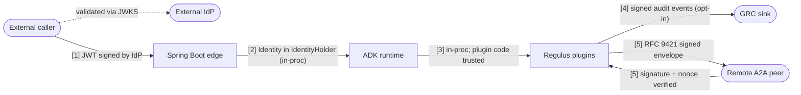

# Security architecture

This page is the contract. The threat model, the SPI signatures, the trust
boundaries, and the failure modes Regulus commits to. For the operational
hardening checklist (TLS, secrets, RBAC at the cloud layer), see
[Production hardening](production-hardening.md). For the regtech framing of
*why* identity matters at all, see
[Concepts → Security model](../concepts/security-model.md).

## Threat model

Regulus defends against:

- **Forged purpose codes.** A caller cannot claim a purpose they don't
  hold in `Claims.purposeCodes`. The `IdentityAdapter` is the single
  point of entry; downstream guards trust only the minted Identity.
- **Unauthenticated plugin invocation.** Plugins run inside the ADK
  request lifecycle, behind an inbound filter that mints the Identity
  before any callback fires.
- **Unsigned cross-org A2A calls.** When an `A2ARequestSigner` is
  configured, outbound envelopes are signed with RFC 9421; inbound
  envelopes are verified before policy guards see them.
- **Audit-log tampering by an in-process actor.** Opt-in audit integrity
  wraps every event in a `SealedAuditEvent` carrying the previous
  event's hash. Mutation breaks verification.
- **Kill-switch bypass.** Activation and dual-control approvals are
  gated by `Identity` roles, with approver-distinctness on
  `Principal.id`.
- **Identity-expiry replay.** A dedicated guard runs first in the
  BeforeModel chain and rejects calls bound to expired tokens.

Regulus does **not** defend against:

- Cloud IAM misconfiguration (a service account with overbroad
  permissions is still a problem Regulus can't see).
- Host compromise. If an attacker runs code in the JVM, they're inside
  the trust boundary.
- Supply-chain attacks on transitive dependencies.
- Insiders with legitimate prod database access.
- OS / kernel CVEs, physical access, side-channel timing attacks on the
  JVM.

These are not gaps Regulus is going to close — they're the boundary
that the cloud provider, the platform team, and the security org own.

## The identity contract

```java
public record Principal(String id, String displayName, PrincipalType type) {
    public enum PrincipalType { HUMAN, SERVICE, AGENT }
}

public record Claims(
        String tenantId,
        Jurisdiction jurisdiction,
        Set<String> purposeCodes,
        Set<String> roles,
        Set<String> lawfulBases,
        Map<String, String> extensions) { }

public record Identity(Principal principal, Claims claims, Provenance provenance) {
    public record Provenance(
            String adapterId,
            Instant mintedAt,
            Instant tokenExpiry,
            String tokenIssuer) {}
}
```

Field-by-field:

| Field | Type | Regulatory anchor |
|---|---|---|
| `Principal.id` | String, unique within tenant | GDPR Art. 30 (records of processing); FCA SYSC 9 (record-keeping) |
| `Principal.type` | enum HUMAN / SERVICE / AGENT | EU AI Act Art. 14 (human oversight) — agents acting *for* humans must be distinguishable |
| `Claims.tenantId` | String | Residency + retention scoping; DORA tenant-aware reporting |
| `Claims.jurisdiction` | enum EU / UK / EU_UK | GDPR vs UK GDPR + DPA 2018 — selects the active compliance profile |
| `Claims.purposeCodes` | Set\<String\> | GDPR Art. 5(1)(b) purpose limitation |
| `Claims.lawfulBases` | Set\<String\> | GDPR Art. 6 (and Art. 9 for special categories) |
| `Claims.roles` | Set\<String\> | EU AI Act Art. 14, FCA SYSC 6 — RBAC for human oversight actions |
| `Provenance.adapterId` | String — `"oidc"`, `"saml"`, `"mtls"`, ... | Auditor question: "how did you know this was them?" |
| `Provenance.tokenExpiry` | Instant | Enforced by `RegulusIdentityExpiryGuard` |
| `Provenance.tokenIssuer` | String | Cross-org audit linking |

`extensions` is `Map<String,String>` deliberately. Custom claims must be
flattened at the trust boundary — if you need structured values, encode
JSON in the string. The discipline matters: it forces every adapter to
make explicit choices about what crosses the boundary, instead of
leaking opaque `Object`s into policy code.

## IdentityAdapter SPI

```java
public interface IdentityAdapter {
    String adapterId();
    Identity authenticate(RequestContext context) throws AuthenticationException;
    default int order() { return 100; }
}
```

Contract:

- **Idempotent.** Two calls with the same `RequestContext` must return
  equal Identities.
- **Fail-closed.** Any verification failure throws
  `AuthenticationException`. Never return a half-populated Identity.
- **Jurisdiction-populating.** `Claims.jurisdiction` must be set —
  every downstream guard depends on it.
- **Ordered.** When multiple adapters are registered (e.g. mTLS at 50,
  OIDC at 100), the lowest `order()` wins.

A custom SAML adapter is about 30 lines:

```java
public final class SamlIdentityAdapter implements IdentityAdapter {
    public String adapterId() { return "saml"; }

    public Identity authenticate(RequestContext ctx) throws AuthenticationException {
        Saml2AuthenticatedPrincipal saml =
            (Saml2AuthenticatedPrincipal) ctx.raw().get("springAuth");
        if (saml == null) throw new AuthenticationException("missing SAML principal");

        String sub = saml.getName();
        String tenant = saml.getFirstAttribute("regulus.tenant");
        String jur    = saml.getFirstAttribute("regulus.jurisdiction");

        return new Identity(
            new Principal(sub, saml.getFirstAttribute("displayName"), Principal.PrincipalType.HUMAN),
            new Claims(
                tenant,
                Jurisdiction.valueOf(jur),
                Set.copyOf(saml.getAttribute("regulus.purpose")),
                Set.copyOf(saml.getAttribute("roles")),
                Set.copyOf(saml.getAttribute("regulus.lawful_basis")),
                Map.of()),
            new Identity.Provenance("saml", Instant.now(), saml.getNotOnOrAfter(), saml.getRelyingPartyRegistrationId())
        );
    }
}
```

Register it as a Spring bean — the `OidcIdentityAdapter` is itself
`@ConditionalOnMissingBean`, so your SAML adapter steps ahead of the
reference.

## Reference OIDC adapter

The reference implementation ships in
`regulus-ai-identity-oidc-spring-boot-starter`. It maps Spring
Security's `JwtAuthenticationToken` to `Identity`:

| JWT claim | Regulus field |
|---|---|
| `sub` | `Principal.id` |
| `preferred_username` (fallback `name`) | `Principal.displayName` |
| `regulus.tenant` (fallback `tid`) | `Claims.tenantId` |
| `regulus.jurisdiction` | `Claims.jurisdiction` (`EU`, `UK`, `EU_UK`) |
| `regulus.purpose` (array) | `Claims.purposeCodes` |
| `regulus.lawful_basis` (array) | `Claims.lawfulBases` |
| `scope` ∪ `roles` ∪ `realm_access.roles` | `Claims.roles` |
| everything else | `Claims.extensions` |

Minimal `application.yaml`:

```yaml
spring:
  security:
    oauth2:
      resourceserver:
        jwt:
          issuer-uri: https://idp.example/realms/regulated-prod

regulus:
  identity:
    oidc:
      enabled: true   # default; turn off to disable the autoconfig
```

Spring Security is `compileOnly` in the starter — non-OIDC tenants who
add `regulus-ai-identity-oidc-spring-boot-starter` *and* leave Spring
Security off the classpath get a dormant autoconfig (gated by
`@ConditionalOnClass(JwtAuthenticationToken.class)`).

The `OidcSecurityContextFilter` runs once per request: reads the
`SecurityContextHolder`, hands the JWT to the adapter, places the
resulting Identity in `IdentityHolder`, and clears the holder in a
`finally` block when the chain unwinds.

## Trust boundaries



Each boundary in detail:

1. **External caller → Spring Boot HTTP.** The IdP-issued JWT is the
   only trusted artefact. Spring Security validates signature, expiry,
   audience, and issuer; the `IdentityAdapter` then mints the canonical
   Identity. If any of these fail, the filter returns 401 before any
   policy code runs.
2. **Spring Boot → ADK runtime.** In-process, single JVM. The Identity
   is propagated via `IdentityHolder` (a `ThreadLocal`). No additional
   verification — the boundary is the process boundary.
3. **ADK runtime → Regulus plugins.** Plugin code is part of the
   trusted base. PolicyContext is derived from Identity via the
   `PolicyContextBridge`; plugins read `Claims` directly.
4. **Plugins → external GRC sinks.** Network egress. When audit
   integrity is enabled, each event is sealed with a hash chain plus
   (optionally) a detached signature from the `KeyProvider`. Sinks that
   want to surface chain metadata override `AuditSink.writeSealed`.
5. **Local agent → remote A2A agent.** The signer commits to method,
   target URI, body digest, tenant id, and correlation id (RFC 9421
   `Signature-Input` selector). The verifier reconstructs the caller's
   Identity from the verified envelope before the inbound filter places
   it in `IdentityHolder` for the downstream pipeline.

## A2A request signing

Recommended scheme: **RFC 9421 HTTP Message Signatures with Ed25519
keys.** RFC 9421 binds the method, target URI, body digest, and a
selected set of headers into a single signature base — gateway proxies
stripping or rewriting a header invalidate the signature. This is
materially safer than a detached JWS over the body alone, which is
silent about HTTP routing context.

```java
public interface A2ARequestSigner {
    SignedEnvelope sign(A2AEnvelope envelope, Identity caller);
    VerifiedCaller verify(SignedEnvelope envelope) throws SignatureException;
}
```

The signature base includes, in order:

1. `"@method"` — request method (e.g. `POST`)
2. `"@target-uri"` — full URI
3. `"content-digest"` — `sha-256=:...:` of the body
4. `"regulus-tenant"` — caller tenant id
5. `"regulus-correlation-id"` — correlation id, surfaced into the audit
   trail on the receiving side
6. `"regulus-identity-adapter"` — which adapter minted the caller

Replay protection: every signature carries a unique `nonce` parameter
and a `created` timestamp. Verifiers reject nonces seen within the
configured replay window (default 5 minutes) and timestamps drifting by
more than the window.

Key material flows through `KeyProvider`:

```java
public interface KeyProvider {
    SigningKey signingKey(String keyId);
    VerificationKey verificationKey(String keyId);
    String defaultSigningKeyId();
}
```

The same `KeyProvider` is consumed by audit integrity — a tenant
configures key management once. Concrete providers (in-process JCA, GCP
KMS, HashiCorp Vault) live in separate starters.

## Audit integrity

Opt-in via `regulus.ai.observability.audit.integrity.enabled=true`. When
on, every `AuditEvent` is appended to an `AuditChain` and the resulting
`SealedAuditEvent` is what each sink sees.

```java
public record SealedAuditEvent(
        AuditEvent event,
        long chainIndex,
        String previousEventHash,
        String eventHash,
        Optional<String> signature,
        String keyId) {}
```

The default `HashChainAuditChain` computes
`SHA-256(prev_hash | canonical_json(event))`. Canonical JSON sorts map
keys, so equal events produce equal hashes regardless of ordering.
`chainIndex` is contiguous and detects gaps. The optional `signature`
slot is populated when a `KeyProvider` is configured — the SPI shape is
stable today even though signing implementation lands in the next
milestone.

Offline verification:

```bash
regulus audit verify ./prod-audit-2026-05-22.jsonl
# regulus audit verify: OK (12473 events)
```

Returns 0 if the chain verifies, 1 if any event is mutated / reordered
/ missing, 2 on I/O or parse errors. Auditors run this against a copy
of the production log to prove tamper-evidence — no Regulus runtime
required.

## Kill-switch authorization

```java
public interface KillSwitchAuthorizer {
    boolean canRequest(Identity identity, KillSwitchState.Scope scope);
    boolean canApprove(Identity identity, KillSwitchState.Scope scope);
    boolean canEmergencyBypass(Identity identity);
}
```

The default `RoleBasedKillSwitchAuthorizer` reads three roles, defaults
configurable via `regulus.kill-switch.roles.{requester,approver,emergency}`:

- `regulus.killswitch.requester` — can request activation / deactivation
- `regulus.killswitch.approver`  — can approve a pending request
- `regulus.killswitch.emergency` — can invoke the emergency bypass

Why approver-distinctness is enforced on `Principal.id` and not on
arbitrary strings: the same human can hold multiple display names, the
same string can be spelled two ways, and a determined defeat of dual
control is one shared mailbox away if the only check is "two different
typed names." A `Principal.id` collision means the same authenticated
subject — that's the right granularity.

See [Dual control / 4-eyes](../concepts/dual-control.md) for the
regulatory framing.

## Failure modes

| Failure | Behaviour | Audit consequence |
|---|---|---|
| `IdentityAdapter` throws `AuthenticationException` | 401 response; no Identity bound | No downstream audit event for the call; filter logs the rejection reason |
| A2A signature verification fails | `SignatureException` short-circuits inbound dispatch | Audit event `A2A_CALL` with `Outcome.BLOCKED` and rejection reason |
| `KeyProvider` unavailable while integrity enabled | `AuditChain` falls back to unsigned chain (hash-only) | Audit log carries `signature: Optional.empty()`; alarms fire from monitoring |
| Audit chain hash mismatch detected at append time | Sink continues writing — the inbound stream cannot stall the request — but verification will fail offline | Out-of-band: regulus audit verify returns 1; SOC investigates |
| `KillSwitchAuthorizer.canApprove` returns false | Approval rejected, request remains pending | Audit event `UNAUTHORIZED_APPROVAL` |
| Token expired (caught by `RegulusIdentityExpiryGuard`) | `PolicyDecision.Block` with code `regulus.identity.token_expired` | Audit event `POLICY_VIOLATION` with that code and the original expiry timestamp |

## Out of scope

Regulus does not pretend to defend against:

- **Insider with prod credentials.** A compromised SRE can do almost
  anything; that's why dual-control deactivation, signed audit chains,
  and per-event KeyProvider-backed signatures exist — to make it
  *visible*, not to make it impossible.
- **OS / kernel CVEs.** Patching is the platform team's job.
- **Supply-chain compromise of dependencies.** Reproducible builds, SBOM
  scanning, dependency pinning live at the build-system layer.
- **Physical access to running JVMs.** If an attacker can read process
  memory, they have the in-process trust.
- **Side-channel timing attacks on Ed25519 verification.** The JCA /
  KMS provider's mitigations are what they are; Regulus doesn't
  re-implement primitives.
- **DDoS / availability.** That's a cloud edge concern.

## Where next

- [Production hardening](production-hardening.md) — the operational
  checklist (TLS, secrets, RBAC, network).
- [Custom policy guards](custom-policy-guards.md) — how to add a guard
  that reads `Claims` directly.
- [EU AI Act → Art. 15 (cybersecurity)](../compliance/eu/eu-ai-act.md) —
  the regulatory anchor for this page.
